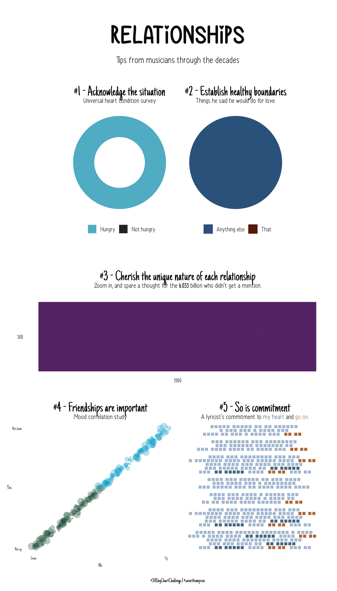
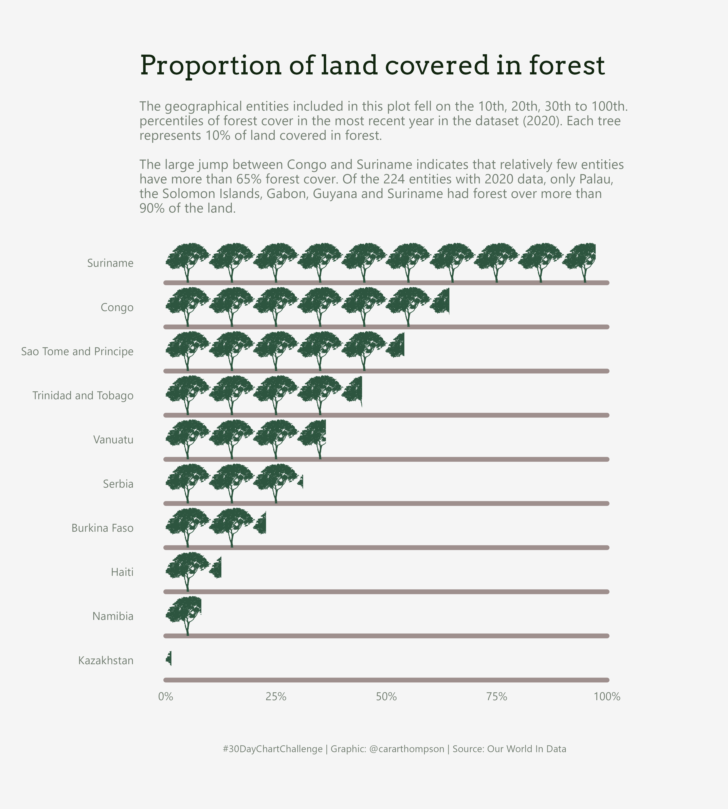

```{r setup, include=FALSE}
knitr::opts_chunk$set(echo = F)
```

Welcome to my 2022 #30DayChartChallenge repo. Clicking on a plot will take you to the code I wrote to build it. Happy browsing, and if you like what you see, [get in touch](https://twitter.com/cararthompson)! 

This year, I don't have capacity to do a plot a day, so I'm doing my best to combine prompts and focus on story telling. Let's see how that goes! 

## Comparisons

### I - Part-to-whole, historical, slope
<p align="center">
<a href='scripts/1.comparisons-part-1.R' target='_blank'></a>
</p>

### II - Pictogram, flora, data from Our World In Data
<p align="center">
<a href='scripts/1.comparisons-part-2.R' target='_blank'></a>
</p>

