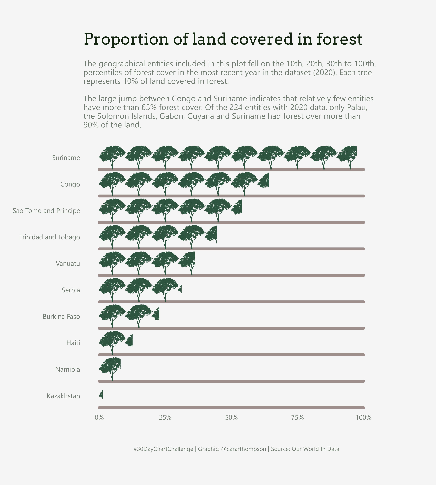

My #30DayChartChallenge contributions - April 2022
================

Welcome to my 2022 #30DayChartChallenge repo. Clicking on a plot will
take you to the code I wrote to build it. Happy browsing, and if you
like what you see, [get in touch](https://twitter.com/cararthompson)!

This year, I don’t have capacity to do a plot a day, so I’m doing my
best to combine prompts and focus on story telling. Let’s see how that
goes!

## Comparisons

### I - Part-to-whole, Historical & Slope

### II - Pictogram, Flora & Data from Our World In Data

## Distributions

### I - Physical, Mountains & Circular

<!-- ### II - Statistics, Experimental, Theme from The Economist -->
<!-- 
 -->
<!--  -->
<!-- 
 -->
